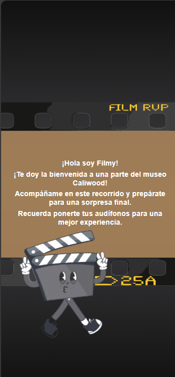

# descripcion del proyecto

**Film Fusion** es una experiencia multimedia interactiva en realidad aumentada diseñada para atraer a la comunidad caleña al Museo CaliWood. El proyecto busca familiarizar a los visitantes con objetos históricos y cinematográficos del museo mediante interacciones visuales, auditivas y táctiles. La aplicación web está desarrollada con React.js y JavaScript, integrando tecnologías de realidad aumentada como AR.js y WebXR. Utiliza APIs modernas para manejo de multimedia y modelado 3D, asegurando una experiencia fluida y envolvente. Film Fusion ofrece una innovadora experiencia educativa y de entretenimiento que combina elementos físicos y digitales para enriquecer la comprensión de la cinematografía y fortalecer la identidad cultural local.

## 🛠️ Stack

- JavaScript with syntax for types.
- Css
- Spline
- Firebase
- Redux

# Ejecución

1.  Instalar las dependencias

    ```bash
    npm install
    ```
2. Correr la aplicación
    ```bash
    npm start
    ```
3. Para poder usar la aplicacion en pc se debe adaptar la pantalla para pantallas de celular, ya que todo esta pensando para un ambiente de celular

4. En el inicio de la aplicacion asegurarse que dentro del url este los siguiente http://localhost:3000/ y se le debe agregarle (**?id=proyector**), ya que dentro de la experencia diseñada, hay un elemento fisico por la cual el usuario accede desde un codigo QR


este el proyecto ya desplegado
<div align="center">
<a href="https://caliwood.netlify.app?id=proyector/">

</a>
<p></p>
</div>